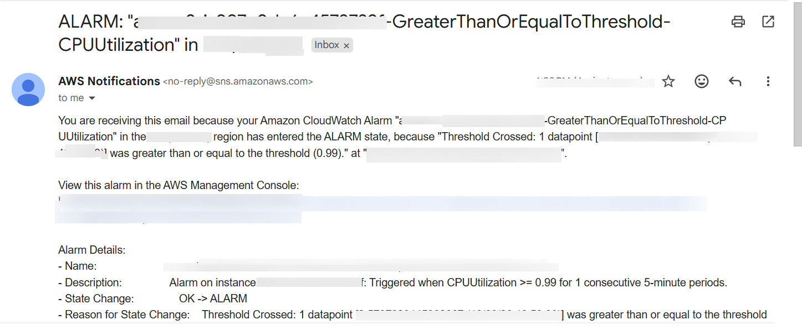
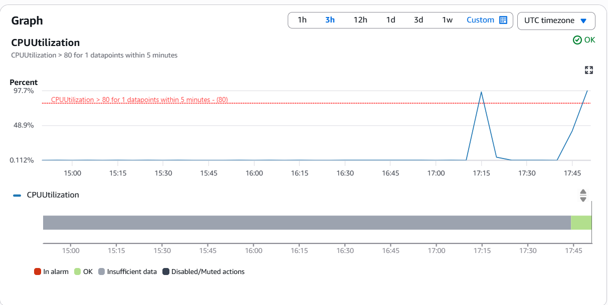

# Issue 3 High CPU Load

## SECURITY NOTE: All sensitive AWS identities (account IDs, instance IDs, IP addresses, ARNs etc) are blurred throughout this documentation.

## Issue Summary

In the following scenario, an EC2 instance experiences high CPU usage, and the steps below show how to implement monitoring and alerts to prevent future incidents.

Before replicating the instance, we are verifying a current CPU state, confirming it's normal:


## Configure SNS and Cloudwatch alarm for high CPU

To receive immediate alerts when CPU usage gets too high and we receive alerts in advance, we should configure SNS notification and CloudWatch Alarm for high CPUUtilization.

### 1. Create an SNS Topic for Alerts

- Go to SNS → Topics → Create topic and select type: Standard and name: high-cpu-alerts


- Create a subscription:
- Protocol: Email, endpoint: your email address then you should confirm the subscription from your inbox.

### 2. Create a CloudWatch Alarm for High CPU

- Select metric:
EC2 → Per‑Instance Metrics → CPUUtilization, threshold: Greater than or equal to 80%, for 5 consecutive minutes

- Notification: Choose SNS topic: high-cpu-alerts, name the alarm: EC2-High-CPU-Alarm


### 3. Attach the Cloudwwatch Alarm to EC2 Instance

- Select existing EC2 instance and select Status and Alarms tab -> click on Edit an alarm and choose existing alarm created in the step 2.

- Alarm notification -> select SNS you've created earlier.

- Alarm thresholds: type -> CPU Utilization, Alarm when greater than 80 percent, period 5 minutes

## Simulate High CPU

To replicate High CPU I used the stress tool to interntionally generate CPU load:

```
 sudo yum install stress -y
```

after installation simulate high CPU:

```
stress --cpu 8 --timeout 300
```

After a couple of minutes we should receive an email regarding our CloudWatch Alarm entered the ALARM state:



And CloudWatch Alarm shows the EC2 CPU usage crosses the threshold we set:



In real scenario this could be runaway application loop or misbehaving service.

### Symptoms

When EC2 instance becomes unresponsive the following symptoms can appear:

- Not possible to access to instance SSH

- Application requests can take much longer to respond

- In EC2 instance CPU utilization more than 80%

## ### Diagnosis Steps

1. Checked CloudWatch Metrics

- CPU Utilization graph spiking to more  than 80%


2. Logged Into the Instance

Ran:

`top`

Observed a single process consuming most CPU.

3. Identifying the Culprit Process

- In this lab, the stress tool was used to intentionally generate CPU load

- In real scenarios, this could be a runaway application loop or misbehaving service

## Root Cause and fix

A process was consuming all available CPU resources, leaving little capacity for normal workloads.

In this lab, the issue was intentionally simulated using the stress tool.

In our case, as we made the CPU high manually, we need to terminate the process:

`kill -9 <pid>
`


In real world a good practice would be to use Auto Scaling Group for horizontal scaling
