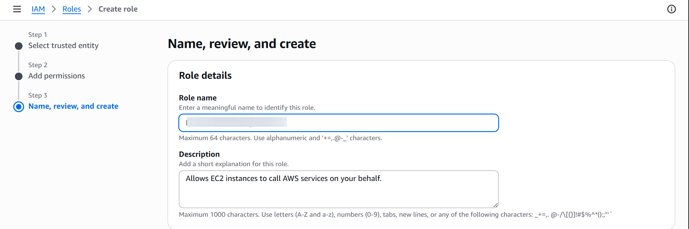

# Issue 4: Disk Full on EC2 Instance

Monitoring, Alerting & Prevention using AWS CloudWatch, SNS, IAM.

The documentation describes how I reproduced, diagnosed, and implemented a monitoring and prevention strategy for a disk full incident on an Amazon EC2 instance.

## SECURITY NOTE: All sensitive AWS identities (account IDs, instance IDs, IP addresses, ARNs etc) are blurred throughout this documentation.

## Issue summary

The goal was to detect the issue early, alert operators, and prevent recurrence.

A disk‑full condition on an EC2 instance can cause:

- Application crashes
- Package installation failures
- Logging failures
- System instability

To replicate the issue filled the root volume with large files.

## Step 1 Install and Configure CloudWatch Agent

Default EC2 monitoring only provides basic metrics as a result we should install CloudWatch Agent as it can collect detailed system level metrics like memory, processes and usage.

But before we install the agent, we would need to configure a new IAM Role. The agent cannot publish metrics until attached to it.

Attached via:
EC2 → Instance → Actions → Security → Modify IAM Role:



If we skip this step we can face the unexpected error during the installation:

```console
NoCredentialProviders: no valid providers in chain
EC2RoleRequestError: no EC2 instance role found
```

After configuring IAM Role we should be good to install the cloudwatch agent:


After installation need to creat a new config file in:

```console
/opt/aws/amazon-cloudwatch-agent/etc/amazon-cloudwatch-agent.json

```
```json
{
  "metrics": {
    "metrics_collected": {
      "disk": {
        "measurement": ["used_percent"],
        "resources": ["*"],
        "ignore_file_system_types": ["sysfs","devtmpfs","tmpfs"]
      }
    }
  }
}
```

Next step is to fetch and apply its configuration and start running:

```console
sudo /opt/aws/amazon-cloudwatch-agent/bin/amazon-cloudwatch-agent-ctl \
  -a fetch-config -m ec2 \
  -c file:/opt/aws/amazon-cloudwatch-agent/etc/amazon-cloudwatch-agent.json -s
```

## Step 2. SNS Topic for Alerts

Create SNS topic:

- Name: <SNS_NAME>
- Subscription: Email

We also need to confirm subscription via email and ensure sns notificstion has been confirmed:


## Step 3: Create CloudWatch Alarm in AWS:

CloudWatch -> Create alarm -> Select Metric (the cloudwatch agent should appear as CWAgent) :


click and select the metric and specify condiiton. In out case we need to trigger an alarm is 80% or higher.

Alarm settings:

- Threshold: > 80%
- Period: 5 minutes
- Evaluation: 1
- Notification: SNS topic <SNS_NAME>


## Step 4. Simulate Full Disk usage and trigger alarm.

Before the disk being full:


I created large files in `/var/tmp` to fill the root volume:

```console
fallocate -l 5G /var/tmp/bigfile1

```
confirmed the disk is full by running

```console
df -h

```


The full disk usage issues start being noticeable if 
- yum failures
- Curl error 23 (“Failed writing received data to disk”)
- System logs unable to write

But since we configured SNS notification and cloudwatch alarm we should receive an email:


and if we check our cloudwatch alarm we can see the following:


## Step 5. What to do when alarm fires

Run diagnostics:

```console
df -h
df -i
sudo du -x / -h --max-depth=1 | sort -hr | head -n 20
```

In our case we added extra files resulting alarm getting triggered but in real scenario a good practice would be to :

- Automate cleanup of temp/log files with cron or SSM Automation documents.
- Plan capacity by resizing EBS volumes or enabling auto‑scaling before reaching critical thresholds.


## Step 6. Cleanup & Reset (Returning the System to Normal)

After completing the simulation, I restored the instance to a healthy state:

- Removed all large simulation files
`sudo rm -f /var/tmp/bigfile*
`
If unsure where large files are located:
`sudo find / -type f -size +500M
`
- Confirmed disk space is normal

`df -h
`


- Restarted CloudWatch Agent
```console
sudo systemctl restart amazon-cloudwatch-agent
```
and check cloudwatch alarm 


